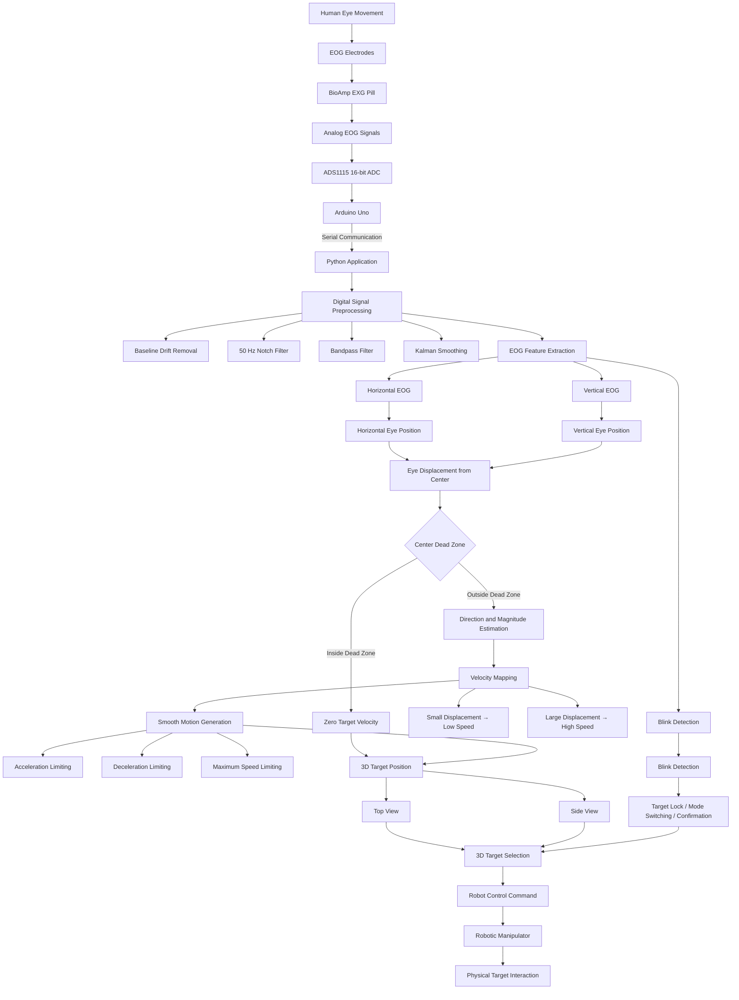
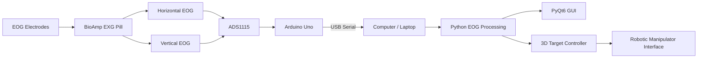

# BE Capstone Project

## 🎥 Project Demonstration [](https://youtu.be/LLZSEM22tTs?si=Ve9w69eN5hiVtP-J)

# EOG-Based 3D Target Selection and Robotic Manipulator Control System Using Eye Movements and Blink Detection

---

## 📌 Project Overview .

This project presents a **low-cost Electrooculography (EOG)-based human–machine interaction system** that uses eye movements and blink detection to control a virtual 3D target-selection environment and generate commands for a robotic manipulator.

Unlike conventional camera-based eye trackers, the proposed system determines eye movement using the electrical potential generated by the movement of the eyeballs. Horizontal and vertical EOG signals are acquired using surface electrodes, amplified using a BioAmp sensor, digitized using an ADS1115 ADC, and transmitted to a computer through an Arduino Uno.

The acquired signals are processed in real time using Python. Signal conditioning and digital processing techniques such as notch filtering, bandpass filtering, baseline-drift removal, and Kalman smoothing are used to obtain a stable representation of eye movement.

The processed EOG signals are converted into continuous horizontal and vertical eye-position information. Instead of treating eye movements only as discrete commands such as LEFT, RIGHT, UP, and DOWN, the magnitude of eye displacement from the calibrated center position is used to control the **speed and direction of target movement**.

A dead-zone around the center prevents unintended movement. As the eye gradually moves away from the center, the target begins moving gradually, and the target velocity increases with increasing eye displacement.

Blink detection is used for functions such as target locking, mode switching, and final target confirmation.

The system provides a foundation for low-cost assistive technology, rehabilitation systems, hands-free interfaces, and EOG-based robotic control.

---

# 👥 Team Details

| Sr. No. | Name of Student        | Roll No. | Branch                  | Email ID                                                                                |
| ------- | ---------------------- | -------: | ----------------------- | --------------------------------------------------------------------------------------- |
| 1       | Shrawan Rakesh Rane    |       24 | Automation and Robotics | [d2024.shrawan.rane@ves.ac.in](mailto:d2024.shrawan.rane@ves.ac.in)                     |
| 2       | Vinod Santosh Kale     |       05 | Automation and Robotics | [d2024.vinod.kale@ves.ac.in](mailto:d2024.vinod.kale@ves.ac.in)                         |
| 3       | Dhanush Balasubramaian |       37 | Automation and Robotics | [d2024.dhanush.balasubramaian@ves.ac.in](mailto:d2024.dhanush.balasubramaian@ves.ac.in) |
| 4       | Rahul Kumar Yadav      |       33 | Automation and Robotics | [2023.rahulkumar.yadav@ves.ac.in](mailto:2023.rahulkumar.yadav@ves.ac.in)               |

---

# 👨‍🏫 Guide Details

**Project Guide:** Dr. Sangeeta Prasannaram / Kader Shaikh

**Department:** Automation and Robotics

**Institute:** Vivekanand Education Society's Institute of Technology (VESIT), Mumbai

---

# 🎯 Problem Statement

Conventional eye-tracking systems generally rely on cameras, infrared illumination, or commercial gaze-tracking hardware. Although these systems can provide high accuracy, they can be expensive, computationally demanding, sensitive to environmental conditions, and difficult to implement in low-cost embedded systems.

There is therefore a need for a **low-cost, portable, real-time eye-controlled human–machine interface** that does not depend on cameras.

Electrooculography (EOG) provides an alternative approach by measuring the electrical potential generated by the movement of the eye. EOG signals can be used to determine horizontal and vertical eye movements and can therefore be used for cursor positioning, target selection, and robotic control.

The objective of this project is to develop an **EOG-based 3D target-selection and robotic manipulator control system** capable of continuously tracking eye movement, positioning a virtual target, detecting blinks, and generating control commands.

---

# 📝 Abstract

Human–machine interaction systems based on biological signals are becoming increasingly important in assistive technology, robotics, rehabilitation, and hands-free computing.

This project proposes an **EOG-Based 3D Target Selection and Robotic Manipulator Control System Using Eye Movements and Blink Detection**. The system enables a user to interact with a virtual 3D workspace using horizontal and vertical eye movements without requiring conventional input devices.

EOG signals are acquired using surface electrodes and a BioAmp EXG Pill. The signals are digitized using an ADS1115 16-bit analog-to-digital converter interfaced with an Arduino Uno. The acquired data is transmitted to a Python application through serial communication.

The Python application performs real-time signal preprocessing, including baseline-drift removal, 50 Hz notch filtering, bandpass filtering, and Kalman-based smoothing. Horizontal and vertical signal components are then used to estimate eye displacement relative to a calibrated center position.

A center dead-zone is implemented to prevent unintended target movement. When the eye moves away from the center, the target moves in the corresponding direction. The magnitude of the eye displacement is mapped to target velocity, allowing slow eye movements to produce slow target motion and larger eye movements to produce faster motion.

The system also incorporates blink detection for target locking, mode switching, and final target confirmation.

The processed eye-position information is displayed through a PyQt6 graphical interface containing live EOG signals, target position, and selection status. The resulting target coordinates and commands can subsequently be mapped to robotic manipulator movements.

The proposed system aims to provide a low-cost, portable, and real-time alternative to camera-based eye-tracking systems for assistive technology, rehabilitation, robotic control, and hands-free human–computer interaction.

---

# 🎯 Objectives

The major objectives of the project are:

* Study the characteristics of Electrooculography (EOG) signals.
* Understand horizontal and vertical eye-movement detection.
* Develop a low-cost EOG acquisition system.
* Interface the BioAmp EXG Pill with an ADS1115 ADC.
* Acquire horizontal and vertical EOG signals using surface electrodes.
* Develop real-time digital signal-processing algorithms.
* Remove baseline drift and unwanted noise from EOG signals.
* Implement 50 Hz notch filtering.
* Implement bandpass filtering suitable for EOG signals.
* Implement signal smoothing using Kalman filtering.
* Estimate continuous horizontal and vertical eye displacement.
* Implement a center dead-zone for stable operation.
* Map eye displacement to target velocity.
* Provide smooth target movement rather than abrupt directional commands.
* Detect blink events.
* Implement target locking and confirmation using blink patterns.
* Develop a 3D target-selection interface.
* Visualize real-time EOG signals and target position.
* Generate control commands for a robotic manipulator.
* Evaluate the system in real-time.
* Analyze accuracy, response time, stability, and repeatability.

---

# 🔬 Scope of the Project

The project covers the following areas:

### EOG Signal Acquisition

* Surface EOG electrodes
* Horizontal EOG channel
* Vertical EOG channel
* BioAmp EXG Pill
* ADS1115 ADC
* Arduino Uno

### Signal Processing

* Digital filtering
* Baseline-drift removal
* 50 Hz notch filtering
* Bandpass filtering
* Signal smoothing
* Kalman filtering
* Eye-position estimation
* Blink detection

### Human–Machine Interaction

* Continuous eye-position tracking
* Center dead-zone detection
* Direction estimation
* Velocity mapping
* Smooth target movement
* Blink-based target locking
* Target confirmation

### Visualization

* Real-time EOG signal display
* Top-view target display
* Side-view target display
* 3D target-position representation
* Target selection status
* Blink/selection status

### Robotic Control

The resulting target position and selection commands can be mapped to a robotic manipulator for physical target selection or manipulation.

The project is limited to **prototype-level implementation** and is not intended for medical diagnosis, clinical monitoring, or medical certification.

---

# 🏗️ System Architecture

The overall system consists of six major stages:

```text
EOG Signal Acquisition
        ↓
Analog Signal Conditioning
        ↓
ADC and Data Acquisition
        ↓
Digital Signal Processing
        ↓
Eye Position + Blink Detection
        ↓
3D Target Selection
        ↓
Robotic Manipulator Commands
```

---

# 📊 Complete System Block Diagram

The following Mermaid diagram can be directly rendered by GitHub:



---

# 👁️ Eye Movement to Target Movement

The core concept of the latest system is **continuous eye-position control**.

The eye is first calibrated at a center/reference position.

Let:

* `X₀` = calibrated horizontal center
* `Y₀` = calibrated vertical center
* `X` = current horizontal EOG position
* `Y` = current vertical EOG position

The displacement is calculated as:

```text
ΔX = X - X₀
ΔY = Y - Y₀
```

The displacement determines both direction and velocity.

### Center Position

When:

```text
|ΔX| < DeadZoneX
|ΔY| < DeadZoneY
```

the target remains stationary.

```text
Eye near center
       ↓
Displacement ≈ 0
       ↓
Velocity = 0
       ↓
Target remains fixed
```

### Eye Moving Away From Center

When the eye gradually moves away from the center:

```text
Small eye displacement
        ↓
Small target velocity
```

and:

```text
Large eye displacement
        ↓
Large target velocity
```

Therefore, the system behaves like a proportional continuous controller rather than a simple gesture classifier.

---

# ⚙️ Velocity Mapping

A basic proportional relationship can be represented as:

```text
Vx = Kx × ΔX

Vy = Ky × ΔY
```

where:

* `Vx` = horizontal target velocity
* `Vy` = vertical target velocity
* `ΔX` = horizontal eye displacement
* `ΔY` = vertical eye displacement
* `Kx` = horizontal scaling factor
* `Ky` = vertical scaling factor

A velocity limit is applied:

```text
-Vmax ≤ Vx ≤ Vmax

-Vmax ≤ Vy ≤ Vmax
```

This prevents excessive target movement.

---

# 🧠 Smooth Motion Generation

Directly converting EOG displacement into target movement can cause sudden changes because EOG signals contain noise and natural physiological variations.

Therefore, a motion-smoothing stage is used.

The system applies:

* Velocity limiting
* Acceleration limiting
* Deceleration limiting
* Signal smoothing
* Center dead-zone
* Maximum movement constraints

Conceptually:

```text
Eye Movement
     ↓
EOG Displacement
     ↓
Velocity Calculation
     ↓
Acceleration Limiting
     ↓
Smooth Target Movement
```

This allows the target to gradually accelerate when the eye moves toward an edge and gradually decelerate when the eye returns toward the center.

---

# 👁️ EOG Electrode Arrangement

Two EOG channels are used:

### Horizontal Channel

Electrodes are positioned approximately on the left and right sides of the eyes.

```text
       LEFT        RIGHT
        ●            ●
         \          /
          \  EYE   /
           \      /
```

Horizontal eye movement produces a measurable change in potential between these electrodes.

### Vertical Channel

Electrodes are positioned above and below the eye.

```text
          ●
        ABOVE
           |
          EYE
           |
        BELOW
          ●
```

Vertical eye movement produces a corresponding change in the measured EOG potential.

A reference/ground electrode is used according to the BioAmp acquisition configuration.

---

# 🔌 Hardware Architecture



---

# 🔩 Hardware Requirements

| Component          | Specification / Purpose                  |
| ------------------ | ---------------------------------------- |
| Arduino Uno        | ATmega328P microcontroller               |
| ADS1115            | 16-bit external ADC                      |
| BioAmp EXG Pill    | EOG signal acquisition and amplification |
| Surface Electrodes | EOG signal pickup                        |
| USB Cable          | Power and serial communication           |
| Computer/Laptop    | Python processing and GUI                |
| Connecting Wires   | Hardware interconnection                 |

---

# 💻 Software Requirements

| Software / Library | Purpose                        |
| ------------------ | ------------------------------ |
| Arduino IDE        | Arduino programming            |
| Python 3.x         | Main application               |
| PyQt6              | Graphical user interface       |
| NumPy              | Numerical computation          |
| SciPy              | Digital signal processing      |
| PySerial           | Serial communication           |
| PyQtGraph          | Real-time signal visualization |
| Matplotlib         | Optional signal analysis       |
| Pandas             | Data logging and analysis      |

---

# 🔄 Working Methodology

## 1. EOG Signal Acquisition

Surface electrodes detect the electrical potential generated by eye movement.

The BioAmp EXG Pill conditions and amplifies the acquired signal.

The horizontal and vertical EOG signals are then digitized using the ADS1115 ADC.

The Arduino Uno receives the ADC data and transmits it to the computer using serial communication.

---

## 2. Digital Signal Preprocessing

The received signal contains:

* Baseline drift
* Power-line interference
* Muscle artifacts
* Electrode noise
* Motion artifacts
* High-frequency noise

Therefore, preprocessing is performed before eye-position estimation.

The processing pipeline is:

```text
Raw EOG
   ↓
Baseline Drift Removal
   ↓
50 Hz Notch Filtering
   ↓
Bandpass Filtering
   ↓
Kalman Smoothing
   ↓
Clean EOG Signal
```

---

# 📉 Signal Filtering

## 50 Hz Notch Filter

A notch filter is used to suppress power-line interference around 50 Hz.

```text
Raw EOG
  │
  ├── 50 Hz interference
  │
  ▼
Notch Filter
  │
  ▼
Reduced Power-Line Noise
```

---

## Bandpass Filter

The EOG signal is passed through an appropriate low-frequency band to suppress unwanted DC drift and high-frequency noise.

A typical prototype configuration is:

```text
High-pass ≈ 0.1 Hz
Low-pass  ≈ 10 Hz
```

The exact cutoff frequencies should be experimentally validated based on the actual BioAmp, electrode setup, sampling rate, and signal quality.

---

# 📈 Baseline Drift Removal

EOG signals can contain slow changes caused by:

* Electrode polarization
* Skin-electrode impedance
* Head movement
* Long-duration eye position
* Environmental interference

Baseline removal is therefore performed before estimating eye displacement.

---

# 🧮 Kalman Smoothing

A Kalman filter can be used to smooth the processed EOG signal while preserving the underlying eye movement.

```text
Filtered EOG
      ↓
Kalman Filter
      ↓
Smoothed EOG
      ↓
Eye Position Estimation
```

This reduces rapid fluctuations that could otherwise cause unwanted target movement.

---

# 🔍 Feature Extraction

The system extracts the following information:

### Horizontal Position

Used to determine:

```text
Left ← Center → Right
```

### Vertical Position

Used to determine:

```text
Up
↑
Center
↓
Down
```

### Blink Events

Used for:

* Target locking
* Mode switching
* Target confirmation

---

# 🎯 3D Target Selection

The system represents a target inside a virtual 3D workspace.

The target position is determined using two primary coordinates:

```text
Horizontal EOG → X-axis

Vertical EOG → Y-axis
```

Depth or additional target-selection information can be determined using the selected view, mode, or confirmation mechanism.

The proposed interface uses multiple views to simplify 3D positioning.

---

# 🖥️ Top View

The top view represents the horizontal workspace.

```text
             TOP VIEW

        ┌─────────────────┐
        │                 │
        │        ●        │
        │      TARGET     │
        │                 │
        └─────────────────┘
              X-axis
```

Horizontal eye movement controls target movement across the top view.

---

# 🖥️ Side View

The side view represents the vertical/depth-related workspace.

```text
             SIDE VIEW

        ┌─────────────────┐
        │        ●        │
        │      TARGET     │
        │                 │
        │                 │
        └─────────────────┘
              Y-axis
```

Vertical eye movement controls target movement in the corresponding direction.

---

# 👁️ + 👁️ Blink Detection

Blink detection provides a separate control channel from continuous eye positioning.

The system can use blink events for:

```text
Eye Movement
     ↓
Target Positioning
     ↓
Target Reached
     ↓
Blink
     ↓
Target Lock / Confirmation
```

Depending on the final implementation, different blink patterns can be assigned to different commands.

For example:

| Blink Event  | Function               |
| ------------ | ---------------------- |
| Single Blink | Target Lock            |
| Double Blink | Confirmation / Execute |
| Long Blink   | Mode Switching         |

The exact blink mapping can be modified during system calibration and testing.

---

# 🖥️ Graphical User Interface

The Python application uses **PyQt6** to provide the graphical interface.

The GUI can contain:

```text
┌─────────────────────────────────────────────┐
│              EOG CONTROL SYSTEM             │
├───────────────────────┬─────────────────────┤
│                       │                     │
│   EOG HORIZONTAL      │      TOP VIEW       │
│       SIGNAL          │                     │
│                       │        ●            │
│   ~~~~~~~~~~~~~~~     │      TARGET         │
│                       │                     │
├───────────────────────┼─────────────────────┤
│                       │                     │
│   EOG VERTICAL        │     SIDE VIEW       │
│       SIGNAL          │                     │
│                       │        ●            │
│   ~~~~~~~~~~~~~~~     │      TARGET         │
│                       │                     │
├───────────────────────┴─────────────────────┤
│ Target Position: X = ___  Y = ___           │
│ Status: TRACKING / LOCKED / CONFIRMED       │
│ Blink: DETECTED / NOT DETECTED              │
└─────────────────────────────────────────────┘
```

---

# 🔁 Complete Data Flow

```text
Eye Movement
     ↓
EOG Electrodes
     ↓
BioAmp EXG Pill
     ↓
ADS1115 ADC
     ↓
Arduino Uno
     ↓
Serial Communication
     ↓
Python Application
     ↓
Signal Preprocessing
     ↓
Feature Extraction
     ↓
 ┌──────────────────────┐
 │                      │
 ▼                      ▼
Eye Position        Blink Detection
 │                      │
 ▼                      ▼
Center / Dead Zone   Mode / Lock /
 │                   Confirmation
 ▼
Direction + Magnitude
 │
 ▼
Velocity Mapping
 │
 ▼
Smooth Motion
 │
 ▼
3D Target Position
 │
 ▼
Target Selection
 │
 ▼
Robot Control Command
 │
 ▼
Robotic Manipulator
```

---

# 🤖 Robotic Manipulator Control

Once the target position has been determined, the selected coordinates can be converted into commands for a robotic manipulator.

The conceptual control architecture is:

```text
EOG
 ↓
Eye Position
 ↓
3D Target Position
 ↓
Target Selection
 ↓
Coordinate Transformation
 ↓
Robot Position / Joint Command
 ↓
Robotic Manipulator
```

The robotic layer can later be implemented using a suitable robot controller, servo system, ROS/ROS2 interface, or other hardware-control architecture.

---

# ⚡ Real-Time Control Concept

The most important feature of the proposed system is that eye movement is treated as a **continuous control input**.

Instead of:

```text
Look Left → Move Left
Look Right → Move Right
```

the system behaves as:

```text
Eye slightly left of center
        ↓
Slow movement to left

Eye further left
        ↓
Faster movement to left

Eye near center
        ↓
Slow movement

Eye at center
        ↓
Target stops
```

The same principle is applied vertically.

This produces a more natural and intuitive control interface.

---

# 🧪 Calibration

Before operation, the system performs calibration.

A typical calibration sequence is:

```text
1. Look at center
       ↓
2. Record center EOG values
       ↓
3. Look left
       ↓
4. Record left range
       ↓
5. Look right
       ↓
6. Record right range
       ↓
7. Look up
       ↓
8. Record upper range
       ↓
9. Look down
       ↓
10. Record lower range
```

The collected values are used to determine:

* Center position
* Operating range
* Dead-zone limits
* Scaling factors
* Velocity limits

---

# 🛡️ Dead-Zone

A center dead-zone prevents involuntary small movements from moving the target.

```text
             UP

              ↑
              │
       ┌──────┼──────┐
       │      │      │
       │      │      │
LEFT ← │──────●──────│ → RIGHT
       │    CENTER   │
       │   DEAD-ZONE │
       └──────┼──────┘
              │
              ↓

             DOWN
```

If the eye remains inside the dead-zone:

```text
Target Velocity = 0
```

If the eye moves outside the dead-zone:

```text
Target Velocity > 0
```

---

# 📊 Expected Outcome

The completed prototype is expected to provide:

* Real-time EOG signal acquisition.
* Reliable horizontal eye-movement detection.
* Reliable vertical eye-movement detection.
* Blink detection.
* Center-position calibration.
* Stable center dead-zone.
* Continuous target movement.
* Proportional velocity control.
* Smooth target acceleration and deceleration.
* Real-time 3D target positioning.
* Target locking and confirmation.
* Live EOG signal visualization.
* Target-position visualization.
* Robot control command generation.
* Low-cost implementation suitable for research and educational applications.

---

# 🌍 Applications

Potential applications include:

### Assistive Technology

Hands-free interaction for users with limited conventional input capability.

### Robotic Manipulation

Eye-controlled selection and manipulation of objects.

### Rehabilitation

Human–machine interfaces for rehabilitation systems.

### Hands-Free Computer Interaction

Cursor and target control without a mouse or conventional controller.

### Smart Home Interfaces

Eye-controlled switching and interaction systems.

### Wheelchair Interfaces

Potential integration with other assistive-control architectures.

### Research and Education

EOG-based biomedical signal processing and human–robot interaction research.

---

# ⚠️ Limitations

The prototype may be affected by:

* Electrode placement
* Skin impedance
* Facial muscle activity
* Head movement
* Electrical interference
* Power-line noise
* Individual differences in EOG amplitude
* Baseline drift
* Blink artifacts
* Calibration accuracy
* User fatigue

Therefore, calibration and signal-quality monitoring are important for reliable operation.

---

# 🚀 Future Scope

The system can be further enhanced through:

* Wireless EOG transmission using ESP32.
* Machine-learning-based eye-movement classification.
* Adaptive calibration.
* Automatic electrode-quality detection.
* Improved artifact rejection.
* Personalized user models.
* Multi-user calibration.
* Higher-performance ADC acquisition.
* Real robotic-arm integration.
* ROS/ROS2-based robotic control.
* Mobile-device integration.
* Cloud-based data analysis.
* Advanced 3D target-selection algorithms.
* Adaptive velocity mapping.
* Predictive eye-movement estimation.

---

# 📁 Proposed Repository Structure

```text
EOG-3D-Target-Robot-Control/
│
├── README.md
│
├── hardware/
│   ├── circuit/
│   ├── schematics/
│   └── datasheets/
│
├── arduino/
│   ├── eog_acquisition/
│   └── blink_detection/
│
├── python/
│   ├── acquisition/
│   ├── preprocessing/
│   ├── filtering/
│   ├── feature_extraction/
│   ├── eye_tracking/
│   ├── blink_detection/
│   ├── target_control/
│   ├── gui/
│   └── main.py
│
├── calibration/
│
├── data/
│   ├── raw/
│   └── processed/
│
├── documentation/
│   ├── block_diagram/
│   ├── circuit_diagram/
│   └── methodology/
│
├── results/
│
└── requirements.txt
```

---

# 🧰 Technologies Used

### Hardware

* Arduino Uno
* ADS1115 16-bit ADC
* BioAmp EXG Pill
* Surface EOG electrodes

### Programming

* C/C++ for Arduino
* Python

### Python Libraries

* NumPy
* SciPy
* PySerial
* PyQt6
* PyQtGraph
* Matplotlib
* Pandas

---

# 📌 Key Features

| Feature             | Description                                 |
| ------------------- | ------------------------------------------- |
| EOG Acquisition     | Horizontal and vertical eye signals         |
| External ADC        | ADS1115 16-bit ADC                          |
| Signal Filtering    | Notch and bandpass filtering                |
| Drift Removal       | Baseline correction                         |
| Signal Smoothing    | Kalman filtering                            |
| Eye Tracking        | Continuous position estimation              |
| Dead Zone           | Prevents unintended movement                |
| Velocity Mapping    | Eye displacement controls target speed      |
| Smooth Motion       | Acceleration/deceleration limiting          |
| Blink Detection     | Selection and confirmation                  |
| 3D Target Selection | Virtual target positioning                  |
| GUI                 | Real-time PyQt6 interface                   |
| Robot Interface     | Command generation for robotic manipulation |

---

# 📈 Performance Parameters

The following parameters can be evaluated during testing:

| Parameter                       | Measurement               |
| ------------------------------- | ------------------------- |
| Eye-movement detection accuracy | Percentage                |
| Blink detection accuracy        | Percentage                |
| Target-position error           | Pixels / coordinate units |
| Response time                   | milliseconds              |
| Selection time                  | seconds                   |
| False activation rate           | Percentage                |
| Calibration time                | seconds                   |
| System latency                  | milliseconds              |
| Target-lock accuracy            | Percentage                |
| Repeatability                   | Percentage                |

---

# 🧪 Testing and Validation

The system can be validated using multiple test cases.

### Test 1 — Center Stability

The user maintains their gaze near the center.

**Expected result:**

```text
Target remains stationary.
```

### Test 2 — Slow Eye Movement

The user slowly moves the eye toward one side.

**Expected result:**

```text
Target begins moving slowly.
```

### Test 3 — Large Eye Displacement

The user moves the eye further toward the edge.

**Expected result:**

```text
Target velocity increases.
```

### Test 4 — Return to Center

The user returns the eye toward the center.

**Expected result:**

```text
Target gradually decelerates
and stops near the center condition.
```

### Test 5 — Blink Confirmation

The user positions the target over the desired location and performs the required blink.

**Expected result:**

```text
Target becomes locked / confirmed.
```

### Test 6 — Repeated Target Selection

Multiple targets are selected consecutively.

**Expected result:**

```text
System maintains stable operation
and produces repeatable selection.
```

---

# 🔐 Safety and Scope Note

This project is an academic prototype for human–machine interaction research.

The system is **not a medical diagnostic device** and should not be used for medical diagnosis, treatment, or clinical decision-making.

---

# 🏁 Conclusion

This project presents a **low-cost EOG-based 3D target-selection and robotic manipulator control system** using eye movements and blink detection.

The system combines biomedical signal acquisition, analog-to-digital conversion, digital signal processing, eye-position estimation, continuous target control, blink detection, graphical visualization, and robotic command generation.

The major improvement of the proposed approach is the use of **continuous eye-position control rather than simple discrete eye gestures**. A calibrated center position and dead-zone provide stability, while the magnitude of eye displacement is mapped to target velocity.

Consequently, small eye movements produce slow target movement, larger eye movements produce faster movement, and returning toward the center reduces the target velocity until it stops.

The resulting architecture provides a foundation for intuitive, low-cost, hands-free human–machine interaction and can be extended toward assistive robotics, rehabilitation, robotic manipulation, and accessible computing systems.

---

# 📚 References

1. J. G. Webster, *Medical Instrumentation: Application and Design*, Wiley.
2. R. S. H. Istepanian, *Biomedical Signal Processing*, IEEE Press.
3. Texas Instruments, **ADS1115 16-Bit Analog-to-Digital Converter Datasheet**.
4. Microchip Technology, **ATmega328P / Arduino Uno Technical Documentation**.
5. Riverbank Computing, **PyQt6 Documentation**.
6. SciPy Documentation, **Signal Processing Module**.
7. NumPy Documentation.
8. PySerial Documentation.
9. PyQtGraph Documentation.
10. Research literature related to EOG-based human–computer interaction, eye-movement detection, assistive technology, and robotic control.

---

# ⭐ Project Summary

```text
                    EOG-BASED HUMAN–MACHINE INTERACTION

                              HUMAN EYE
                                  │
                                  ▼
                          EOG ELECTRODES
                                  │
                                  ▼
                           BIOAMP EXG PILL
                                  │
                                  ▼
                           ADS1115 ADC
                                  │
                                  ▼
                            ARDUINO UNO
                                  │
                            SERIAL DATA
                                  │
                                  ▼
                         PYTHON APPLICATION
                                  │
                     ┌────────────┴────────────┐
                     │                         │
                     ▼                         ▼
              SIGNAL PROCESSING          BLINK DETECTION
                     │                         │
                     ▼                         ▼
             EYE POSITION              LOCK / CONFIRM
                     │
                     ▼
              CENTER DEAD-ZONE
                     │
                     ▼
             DIRECTION + MAGNITUDE
                     │
                     ▼
               VELOCITY MAPPING
                     │
                     ▼
              SMOOTH MOTION CONTROL
                     │
                     ▼
             3D TARGET POSITION
                     │
                     ▼
              TARGET SELECTION
                     │
                     ▼
             ROBOT CONTROL COMMAND
                     │
                     ▼
              ROBOTIC MANIPULATOR
```

## 🔑 Core Concept

**Eye movement → EOG signal → signal processing → continuous eye position → displacement from center → velocity → smooth 3D target movement → blink-based selection → robotic command**
